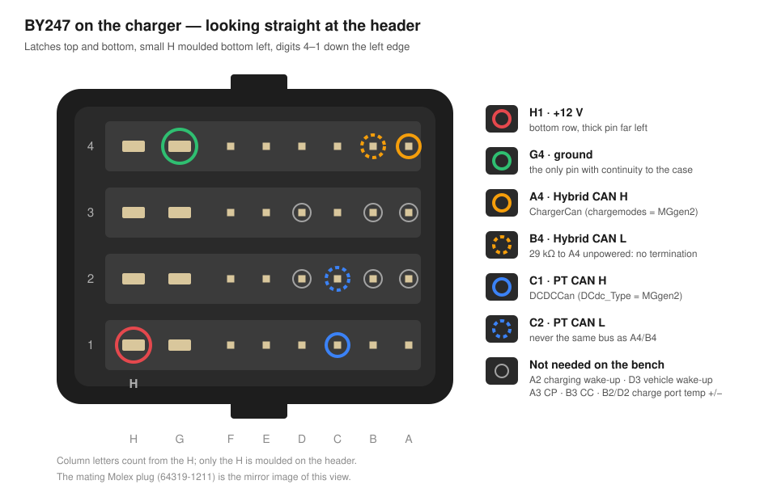

# MG ZS EV gen 2 charger on the ZombieVerter

The 11 kW on-board charger with built-in DC-DC converter from the MG ZS EV
(2021 on): SAIC `EP2CCU1130A`, MG part number `11236823`. It takes two drivers,
one per bus:

| Driver | Parameter | Bus |
|---|---|---|
| `MGgen2Charger` | `chargemodes` = 7 `MGgen2` | `ChargerCan`: Hybrid CAN, BY247 A4/B4 |
| `MGgen2DCDC` | `DCdc_Type` = 3 `MGgen2` | `DCDCCan`: PT CAN, BY247 C1/C2 |

**Status: not run with high voltage yet.** Every frame is tested against
captures of a real car (`test/test_mggen2.cpp`), the state machine against a
fake bus (`test/test_mggen2charger.cpp`), and one unit has been on the bench
with 12 V only (below). Until it has charged a pack, treat it as unproven.

## Settings

| Parameter | Value | Why |
|---|---|---|
| `chargemodes` | 7 = MGgen2 | |
| `ChargerCan` | the bus wired to A4/B4 | |
| `DCdc_Type` | 3 = MGgen2 | |
| `DCDCCan` | the *other* bus, wired to C1/C2 | `0x297`, `0x29B` and `0x39B` exist on both buses with different payloads |
| `Voltspnt` | the pack's charge voltage limit | sent in steps of 0.02 V; the parameter itself has steps of 1/32 V |
| `Pwrspnt` | e.g. 11000 W | the current request is never more than `Pwrspnt` / `udc`, and the default of 1500 W is under 4 A at 400 V |

The DC current requested is the lowest of 51.1 A (what the car always asks),
`Pwrspnt` / `udc`, and `BMS_ChargeLim` when a BMS reports one. The MG reads the
AC pilot itself (CP and CC on A3/B3), so the EVSE limits it further through the
duty cycle, and a charge starts on the charger's own start signal (`0x33B`
bit 7 with a valid duty), not on a charge interface.

`ChgTemp` shows the hotter of the two charger temperatures in `0x324`, and so
takes part in the cooling fan control in charge mode.

## The signal connector, BY247

A 32-way Molex CMC header; the mating plug is Molex `64319-1211`
(8 × 1.5 mm and 24 × 0.64 mm contacts). Nothing on the plug is numbered. On the
header on the unit there are two small moulded markings: an **H** bottom left,
and the digits **4 3 2 1** down the left edge. Look at it with the latches top
and bottom and the H bottom left. Each row has two thick pins on the left
(columns H and G) and six thin ones (F to A). Only the H is marked; count the
other columns from it.

| Pin | Where, looking at the header | Function |
|---|---|---|
| **H1** | bottom row, thick pin far left | +12 V |
| **G4** | top row, second thick pin | ground |
| **A4** | top row, thin pin far right | Hybrid CAN H |
| **B4** | top row, second from right | Hybrid CAN L |
| **C1** | bottom row, third from right | PT CAN H |
| **C2** | second row from the bottom, third from right | PT CAN L |
| A2 | second row from the bottom, far right | charging wake-up |
| D3 | second row from the top, fourth from right | vehicle wake-up |
| A3 / B3 | second row from the top, far right / second from right | CP / CC of the charge port |
| B2 / D2 | second row from the bottom, second / fourth from right | charge port temperature sensor + / − |

The functions come from MG's table for BY247 (`v2lChargerPinout.png` in
[damienmaguire/MG-EV-Charger](https://github.com/damienmaguire/MG-EV-Charger)).
That drawing is an end view of the *harness* connector, the mirror image of the
header. The 12-way `BY400` found in older notes belongs to the 6.6 kW charger
without a DC-DC converter and has a different pinout. Which way A2 and D3 work
(input or output) has not been measured.

**Check before applying power**, unit unpowered:

| Between | Measured on our unit | What it tells you |
|---|---|---|
| G4 and the metal case | continuity; **G4 is the only pin that has it** | you are reading the header the right way up |
| H1 and G4 | not a short | |
| A4 and B4 | **29 kΩ** | a CAN transceiver input, no termination: the unit terminates neither end, so put 120 Ω at both ends of the harness (60 Ω between H and L once connected) |
| C1 and C2 | not measured yet | |

## The high-voltage connectors

| On the unit | What it is | Mating plug |
|---|---|---|
| `HVC5P63MV105`, code A | Amphenol HVC, 5-way, 6.3 mm contacts: AC input | `HVC5P63FS106` |
| `HVC2P63`, code A | Amphenol HVC, 2-way, 6.3 mm contacts: DC output | `HVC2P63FS106` (6 mm²) |

Coding A is digit 1 in the part number; a plug with other coding does not fit.
`PA66-GF25` on the housing is the material, not a part number. Some sources give
`HVC2P28` for the DC side; our unit says `HVC2P63`. The mating part numbers
follow Amphenol's numbering scheme and have not been checked against a
datasheet: confirm before ordering.

## On the bench: 12 V only (2026-09-15)

Bench supply on H1 (+) and G4 (−), a CANable on A4/B4 in **normal mode**, 20 cm
of jumper wire. Not listen-only: with only two nodes on the bus, a listen-only
adapter never acknowledges, and the charger keeps repeating its first frame.
No mains, no high voltage, no coolant.

**Supply.** Set a current limit of 1 A, with the supply limiting rather than
tripping. At a 0.2 A limit the unit did not start: the supply first switched
itself off on over-current (one frame of each ID got out), and then held only
5 V. Limiting at 1 A it ran at 12.5 V and the supply showed **0.74 A**. Whether
the draw drops once the unit falls silent was not measured.

**What it sends.** Right after power-up, with nothing else talking, the unit
sends six IDs every 100 ms for **4.9 s**, 50 frames each, and then nothing.
Two power-ups gave the same frames at the same times, with the bus error
counters at 0. Only the Hybrid bus was recorded.

| ID | First frame | After it settles | What changes |
|---|---|---|---|
| `0x323` | `00 00 00 00 00 00 00 00` | D7:D8 cycle | from 1.0 s, every 0.5 s: `1D65`, `1D83` or `1FAD`, `1FC5`, `0000`. Unknown |
| `0x324` | `00 00 00 28 28 00 00 00` | `00 00 00 3F 3F 00 00 00` | D4 and D5 are temperatures with an offset of 40. D4 climbs from `28` (0 °C); D5 jumps to `51` (41 °C) at 0.1 s and falls back. Both read 23 °C, the room, by 3.3 s |
| `0x33B` | `64 00 00 7C 00 00 00 00` | `00 00 00 40 00 00 00 00` | D1 `64` (100 %, static pilot) for 0.6 s, then `00`: no pilot. D4 falls from `7C` to `40` by 0.8 s: 24 °C with the same offset |
| `0x33D` | `00 00 10 20 00 18 00 00` | D6 `28` | D6 `18` → `28` at 3.0 s. Unknown |
| `0x3B7` | `00 00 00 00 00 01 01 00` | D3 `40` | D6 counts 0–F every 100 ms and D7 repeats it; from 1.0 s D3 and D7 carry flag `0x40` |
| `0x491` | zeros | zeros | no mains, nothing to measure |

What that means for the drivers:

- A frame from the charger takes `MGgen2Charger` out of `Asleep`, and 4.9 s is
  plenty for that. A VCU and a charger that power up together therefore start
  talking. **Whether the standby frames then keep the unit awake is the next
  bench test.** In the car it also wakes itself when a plug goes in
  (`0944_wakeup by plug insertion.csv`: the charger talks alone for 6.57 s).
- The temperatures need about 3 s to settle, so `ChgTemp` is only written once
  the charger has been talking for 3.5 s, and again after every power-up.
- `0x324` D4/D5 with offset 40 also fit the car: `3B` to `42` at rest, and
  `3D` rising to `4C` in two minutes at 10 kW.

The captures are next to this file, in `candump -L` format at 500 kbit/s:
[bench-2026-09-15-hybrid-a.log](bench-2026-09-15-hybrid-a.log) and
[bench-2026-09-15-hybrid-b.log](bench-2026-09-15-hybrid-b.log).

## Not proven yet

1. That the unit stays awake on our frames, still without high voltage.
2. `0x297` D5:D6 = `FFFF` while charging. The car sends a value there that
   has not been decoded; does the charger accept `FFFF`?
3. The stop request, `0x297` D1 bit `0x20`: seen once, in one capture.
4. The DC-DC without the Hybrid messages, and whether `0x19C` D3:D4 is its
   setpoint.
5. The PT bus on the bench, termination on C1/C2, and what A2 and D3 do.

## Sources

- CAN captures of an MG ZS EV by Lars (EVcreate), in
  [damienmaguire/MG-EV-Charger](https://github.com/damienmaguire/MG-EV-Charger),
  `CANLogs/Gen2/Lars`. Every frame builder is tested against them, with file
  name and time stamp next to each expected frame.
- MG's pinout table for BY247, same repository.
- The bench captures above.
